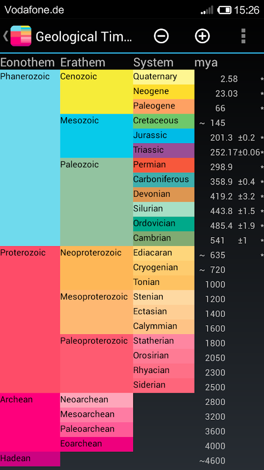
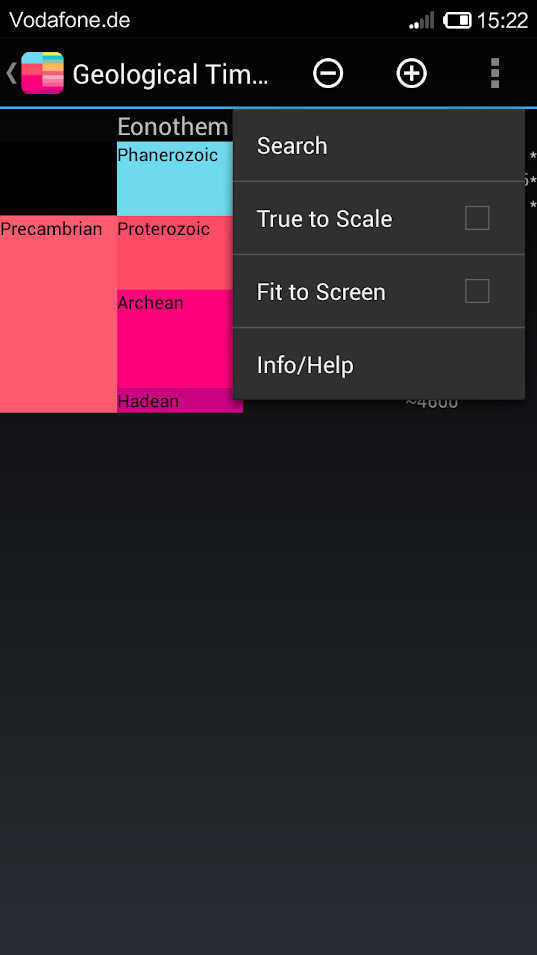
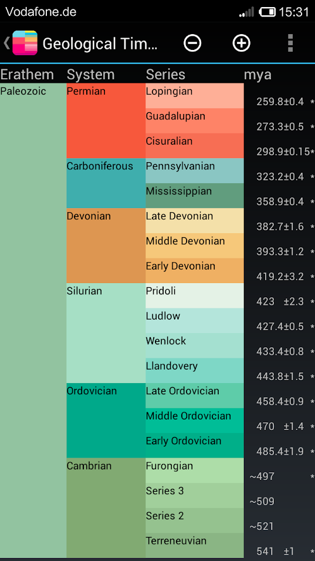

# Geological Time Scale

This Android App shows the geological time scale of the history of the
earth. The time scale shows the units Eonothem, Erathem, Period, Epoch and
Stage. It shows the begin of every period and if it is a GSSP. The time scale
can be scrolled up and down if it does not fit on the screen. The view can be
changed to fit the height of the display. Additionally, there is a true to scale
option which sets the height of all periods according to its duration. You can
select a period by touching it. Then, only the selected period and the
subsequent periods are shown.

With the plus button it is possible to add a column with the more detailed unit
at the right. The minus button removes the rightmost column. By sliding left or
right, the view can be moved towards the more detailed or more coarse units.

There is also a search function which highlights the desired period.

## Download

## Screenshots

## Credits

The time scale is based on data from

- https://en.wikipedia.org/wiki/Geologic_time_scale
- https://de.wikipedia.org/wiki/Geologische_Zeitskala
- https://zh.wikipedia.org/wiki/%E5%9C%B0%E8%B4%A8%E5%B9%B4%E4%BB%A3
- https://stratigraphy.org/
